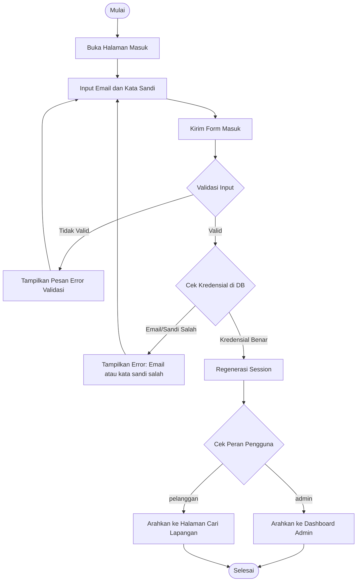
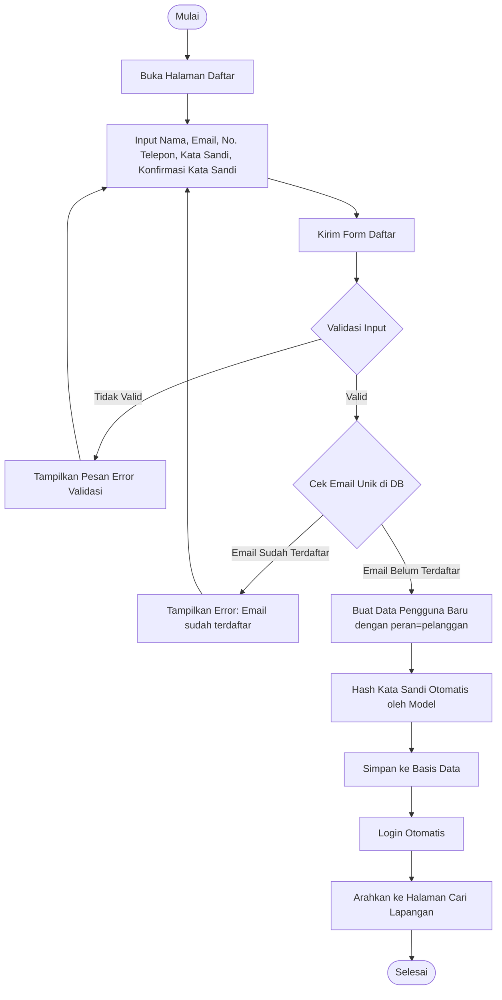
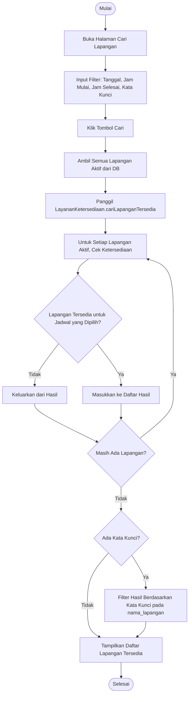
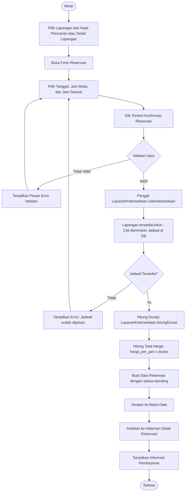
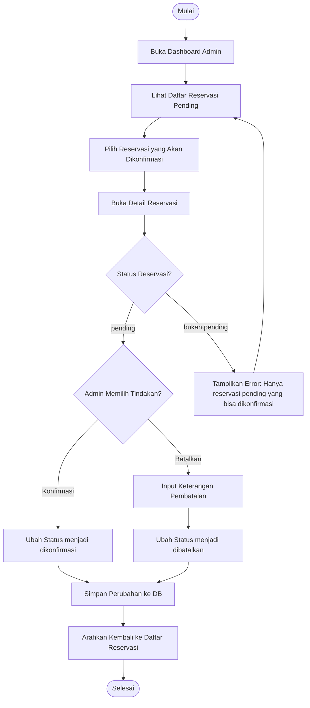
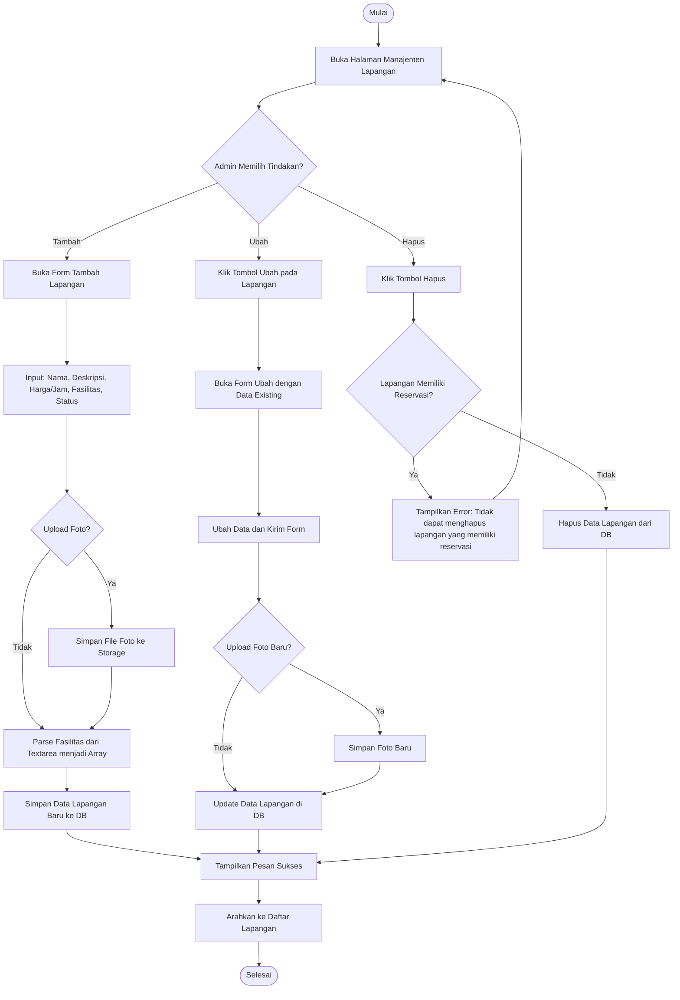
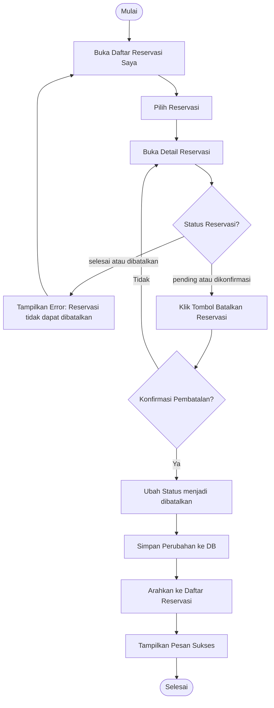

# Activity Diagram - Sistem Reservasi Pintar Lapangan Futsal

## Deskripsi

Activity Diagram ini menggambarkan alur kerja (workflow) dari proses-proses utama dalam sistem reservasi futsal. Setiap diagram merepresentasikan langkah-langkah sistematis yang terjadi dari awal hingga akhir suatu aktivitas, termasuk percabangan kondisi (decision) dan aktivitas paralel.

---

## 1. Activity Diagram - Proses Masuk (Login)

### Deskripsi
Menggambarkan alur proses autentikasi pengguna saat masuk ke sistem, dimulai dari input kredensial hingga pengalihan berdasarkan peran.

### Kelas Terkait
- `AutentikasiController::prosesMasuk()`
- `CekPeran::handle()`

---

## 2. Activity Diagram - Proses Pendaftaran (Register)

### Deskripsi
Menggambarkan alur pendaftaran akun pelanggan baru, mulai dari pengisian form hingga otomatis login setelah berhasil.

### Kelas Terkait
- `AutentikasiController::prosesDaftar()`
- `Pengguna` (Model)

---

## 3. Activity Diagram - Pencarian Lapangan

### Deskripsi
Menggambarkan alur pelanggan mencari lapangan futsal berdasarkan tanggal, jam, dan kata kunci. Sistem menggunakan `LayananKetersediaan` untuk memfilter lapangan yang tersedia.

### Kelas Terkait
- `Pelanggan\LapanganController::index()`
- `LayananKetersediaan::cariLapanganTersedia()`
- `Lapangan` (Model)

---

## 4. Activity Diagram - Pembuatan Reservasi

### Deskripsi
Menggambarkan alur lengkap pembuatan reservasi oleh pelanggan, mulai dari pemilihan lapangan hingga penyimpanan data reservasi dan penampilkan informasi pembayaran.

### Kelas Terkait
- `Pelanggan\ReservasiController::simpan()`
- `LayananKetersediaan::cekKetersediaan()`, `hitungDurasi()`, `hitungTotalHarga()`
- `Lapangan::tersediaUntuk()`
- `Reservasi` (Model)

---

## 5. Activity Diagram - Konfirmasi Reservasi oleh Admin

### Deskripsi
Menggambarkan alur admin dalam mengkonfirmasi reservasi pelanggan. Admin memverifikasi pembayaran dan mengubah status reservasi dari `pending` menjadi `dikonfirmasi`.

### Kelas Terkait
- `Admin\ReservasiController::konfirmasi()`
- `Admin\ReservasiController::batalkan()`
- `Admin\ReservasiController::selesai()`
- `Reservasi` (Model)

---

## 6. Activity Diagram - Pengelolaan Lapangan oleh Admin

### Deskripsi
Menggambarkan alur admin dalam mengelola data lapangan, termasuk menambah, mengubah, dan menghapus lapangan.

### Kelas Terkait
- `Admin\LapanganController::simpan()`, `perbarui()`, `hapus()`
- `Lapangan` (Model)

---

## 7. Activity Diagram - Pembatalan Reservasi oleh Pelanggan

### Deskripsi
Menggambarkan alur pelanggan membatalkan reservasi yang telah dibuat.

### Kelas Terkait
- `Pelanggan\ReservasiController::batalkan()`
- `Reservasi` (Model)

