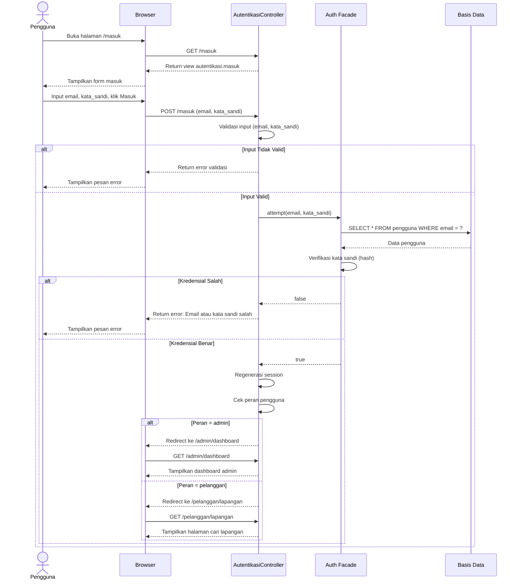
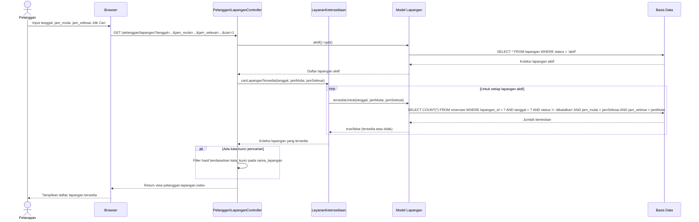
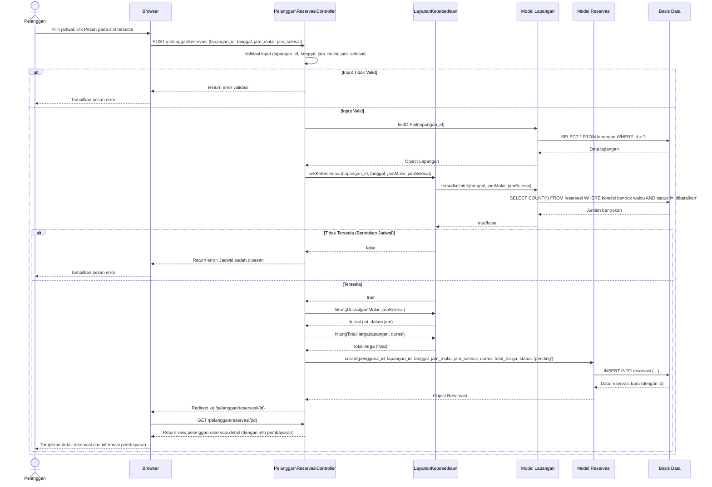
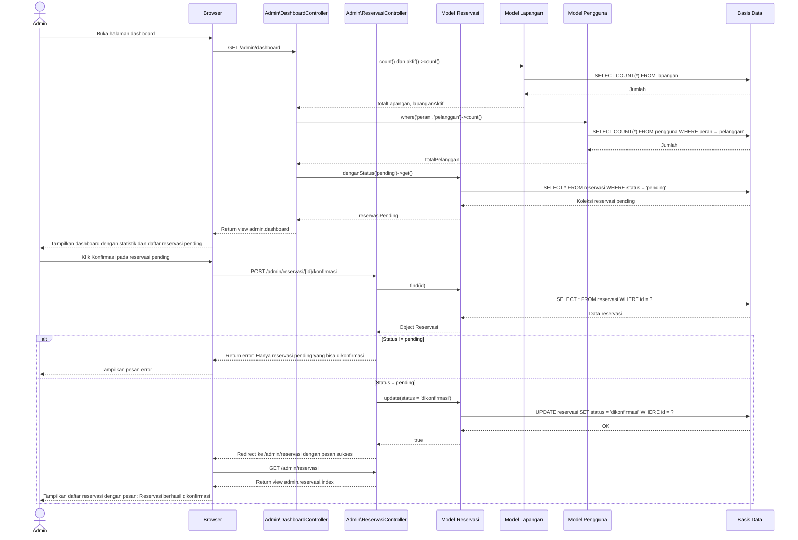
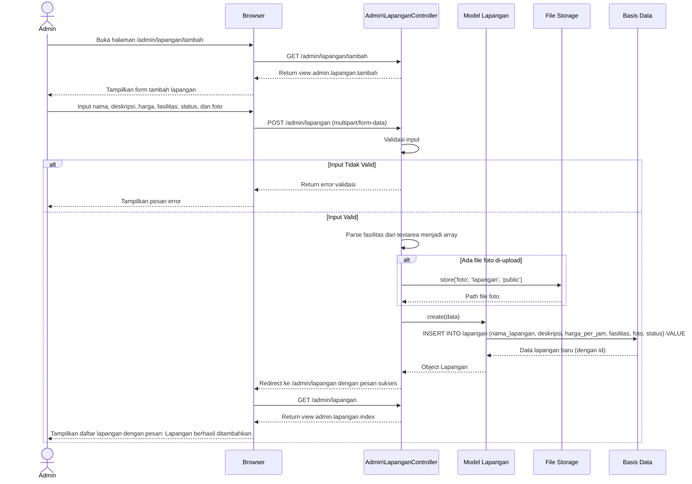
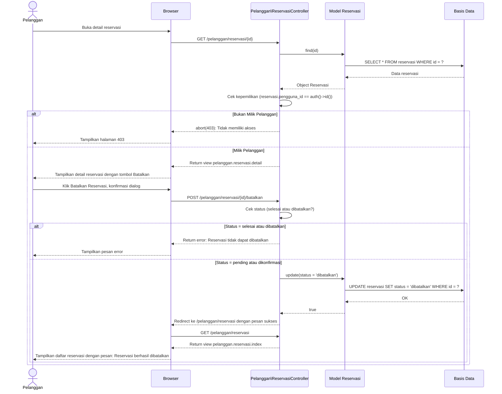

# Sequence Diagram - Sistem Reservasi Pintar Lapangan Futsal

## Deskripsi

Sequence Diagram ini menggambarkan interaksi antar objek dalam sistem secara berurutan berdasarkan waktu. Setiap diagram merepresentasikan skenario penggunaan spesifik, menunjukkan pesan-pesan yang dikirim antar objek (Pelanggan, Browser, Controller, Service, Model, dan Basis Data) untuk menyelesaikan suatu proses.

---

## 1. Sequence Diagram - Proses Masuk (Login)

### Skenario
Pelanggan/Admin masuk ke sistem dengan memasukkan email dan kata sandi. Sistem memvalidasi kredensial dan mengarahkan pengguna ke halaman sesuai peran.

### Kelas yang Terlibat
- `AutentikasiController::prosesMasuk()`
- `CekPeran::handle()`
- `Pengguna` (Model)
- `Auth` (Facade Laravel)

---

## 2. Sequence Diagram - Pencarian Lapangan

### Skenario
Pelanggan mencari lapangan berdasarkan tanggal, jam mulai, dan jam selesai. Sistem menggunakan `LayananKetersediaan` untuk mengecek ketersediaan setiap lapangan aktif.

### Kelas yang Terlibat
- `Pelanggan\LapanganController::index()`
- `LayananKetersediaan::cariLapanganTersedia()`
- `Lapangan` (Model)

---

## 3. Sequence Diagram - Pembuatan Reservasi

### Skenario
Pelanggan membuat reservasi lapangan. Sistem memvalidasi input, mengecek ketersediaan jadwal, menghitung harga, dan menyimpan data reservasi.

### Kelas yang Terlibat
- `Pelanggan\ReservasiController::simpan()`
- `LayananKetersediaan::cekKetersediaan()`, `hitungDurasi()`, `hitungTotalHarga()`
- `Lapangan::tersediaUntuk()`
- `Reservasi` (Model)

---

## 4. Sequence Diagram - Konfirmasi Reservasi oleh Admin

### Skenario
Admin melihat reservasi pending di dashboard, membuka detail, dan mengkonfirmasi reservasi setelah memverifikasi pembayaran.

### Kelas yang Terlibat
- `Admin\DashboardController::index()`
- `Admin\ReservasiController::konfirmasi()`
- `Reservasi` (Model)

---

## 5. Sequence Diagram - Pengelolaan Lapangan (Tambah) oleh Admin

### Skenario
Admin menambah lapangan baru melalui form. Sistem memvalidasi input, memproses fasilitas dan foto, lalu menyimpan data lapangan.

### Kelas yang Terlibat
- `Admin\LapanganController::simpan()`
- `Lapangan` (Model)

---

## 6. Sequence Diagram - Pembatalan Reservasi oleh Pelanggan

### Skenario
Pelanggan membatalkan reservasi miliknya. Sistem memverifikasi kepemilikan dan status reservasi sebelum memproses pembatalan.

### Kelas yang Terlibat
- `Pelanggan\ReservasiController::batalkan()`
- `Reservasi` (Model)

