# Use-Case Diagram - Sistem Reservasi Pintar Lapangan Futsal

## Deskripsi

Use-Case Diagram ini menggambarkan seluruh interaksi antara aktor (Pelanggan dan Admin) dengan sistem reservasi futsal. Diagram ini mencakup semua fungsionalitas utama yang tersedia bagi masing-masing aktor berdasarkan alur kerja sistem yang telah dibangun.

## Aktor

| Aktor | Deskripsi |
|-------|-----------|
| **Pelanggan** | Pengguna yang mendaftar dan menggunakan sistem untuk mencari lapangan, melihat ketersediaan jadwal, melakukan reservasi, dan melihat informasi pembayaran |
| **Admin** | Pemilik bisnis (Ulil Amri) yang mengelola data lapangan, mengkonfirmasi/membatalkan reservasi, memantau dashboard statistik, dan menandai reservasi selesai |

## Use-Case

### Use-Case Pelanggan
| Kode | Nama Use-Case | Deskripsi |
|------|---------------|-----------|
| UC-01 | Daftar | Pelanggan membuat akun baru dengan mengisi nama, email, nomor telepon, dan kata sandi |
| UC-02 | Masuk | Pelanggan masuk ke sistem menggunakan email dan kata sandi |
| UC-03 | Keluar | Pelanggan mengakhiri sesi login |
| UC-04 | Cari Lapangan | Pelanggan mencari lapangan berdasarkan tanggal, jam mulai, jam selesai, dan kata kunci |
| UC-05 | Lihat Detail Lapangan | Pelanggan melihat informasi lengkap lapangan (harga, fasilitas, deskripsi) beserta slot ketersediaan per jam |
| UC-06 | Buat Reservasi | Pelanggan melakukan pemesanan lapangan dengan memilih tanggal, jam mulai, dan jam selesai |
| UC-07 | Lihat Daftar Reservasi | Pelanggan melihat riwayat seluruh reservasi miliknya |
| UC-08 | Lihat Detail Reservasi | Pelanggan melihat detail reservasi termasuk informasi pembayaran |
| UC-09 | Batalkan Reservasi | Pelanggan membatalkan reservasi yang belum selesai atau belum dibatalkan |
| UC-10 | Lihat Informasi Pembayaran | Pelanggan melihat instruksi pembayaran (bank, nomor rekening, jumlah transfer) pada halaman detail reservasi |

### Use-Case Admin
| Kode | Nama Use-Case | Deskripsi |
|------|---------------|-----------|
| UC-11 | Masuk (Admin) | Admin masuk ke sistem menggunakan email dan kata sandi admin |
| UC-12 | Keluar (Admin) | Admin mengakhiri sesi login |
| UC-13 | Lihat Dashboard | Admin melihat statistik sistem: total lapangan, total pelanggan, pendapatan hari ini/bulan ini, reservasi pending, dan reservasi hari ini |
| UC-14 | Kelola Lapangan | Admin menambah, mengubah, dan menghapus data lapangan |
| UC-15 | Tambah Lapangan | Admin menambah lapangan baru (nama, deskripsi, harga, fasilitas, status) |
| UC-16 | Ubah Lapangan | Admin mengubah data lapangan yang sudah ada |
| UC-17 | Hapus Lapangan | Admin menghapus lapangan (jika tidak memiliki reservasi) |
| UC-18 | Kelola Reservasi | Admin melihat, memfilter, mengkonfirmasi, membatalkan, dan menandai selesai reservasi |
| UC-19 | Konfirmasi Reservasi | Admin mengkonfirmasi reservasi yang berstatus pending |
| UC-20 | Batalkan Reservasi | Admin membatalkan reservasi beserta keterangan pembatalan |
| UC-21 | Tandai Reservasi Selesai | Admin menandai reservasi yang sudah dikonfirmasi menjadi selesai |
| UC-22 | Filter Reservasi | Admin memfilter daftar reservasi berdasarkan status dan tanggal |

## Diagram

```mermaid
graph TB
    subgraph Sistem Reservasi Pintar Lapangan Futsal
        UC01(UC-01: Daftar)
        UC02(UC-02: Masuk)
        UC03(UC-03: Keluar)
        UC04(UC-04: Cari Lapangan)
        UC05(UC-05: Lihat Detail Lapangan)
        UC06(UC-06: Buat Reservasi)
        UC07(UC-07: Lihat Daftar Reservasi)
        UC08(UC-08: Lihat Detail Reservasi)
        UC09(UC-09: Batalkan Reservasi)
        UC10(UC-10: Lihat Informasi Pembayaran)
        UC11(UC-11: Masuk Admin)
        UC12(UC-12: Keluar Admin)
        UC13(UC-13: Lihat Dashboard)
        UC15(UC-15: Tambah Lapangan)
        UC16(UC-16: Ubah Lapangan)
        UC17(UC-17: Hapus Lapangan)
        UC19(UC-19: Konfirmasi Reservasi)
        UC20(UC-20: Batalkan Reservasi Admin)
        UC21(UC-21: Tandai Reservasi Selesai)
        UC22(UC-22: Filter Reservasi)
    end

    Pelanggan --> UC01
    Pelanggan --> UC02
    Pelanggan --> UC03
    Pelanggan --> UC04
    Pelanggan --> UC05
    Pelanggan --> UC06
    Pelanggan --> UC07
    Pelanggan --> UC08
    Pelanggan --> UC09
    Pelanggan --> UC10

    Admin --> UC11
    Admin --> UC12
    Admin --> UC13
    Admin --> UC15
    Admin --> UC16
    Admin --> UC17
    Admin --> UC19
    Admin --> UC20
    Admin --> UC21
    Admin --> UC22

    UC06 -.->|include| UC04
    UC06 -.->|include| UC05
    UC10 -.->|include| UC08
```

## Relasi Include/Extend

| Relasi | Tipe | Keterangan |
|--------|------|------------|
| UC-06 include UC-04 | include | Sebelum membuat reservasi, pelanggan harus mencari lapangan terlebih dahulu |
| UC-06 include UC-05 | include | Sebelum membuat reservasi, pelanggan melihat detail lapangan dan ketersediaan slot |
| UC-10 include UC-08 | include | Informasi pembayaran ditampilkan di dalam halaman detail reservasi |
