# Class Diagram - Sistem Reservasi Pintar Lapangan Futsal

## Deskripsi

Class Diagram ini menggambarkan struktur kelas-kelas dalam sistem beserta atribut, metode, dan relasi antar kelas. Diagram ini dibuat berdasarkan implementasi kode yang sesungguhnya di proyek Laravel ini.

## Daftar Kelas

| Kelas | Namespace | Tipe | Deskripsi |
|-------|-----------|------|-----------|
| Pengguna | App\Models\Pengguna | Model (Eloquent) | Merepresentasikan pengguna sistem (admin dan pelanggan) |
| Lapangan | App\Models\Lapangan | Model (Eloquent) | Merepresentasikan data lapangan futsal |
| Reservasi | App\Models\Reservasi | Model (Eloquent) | Merepresentasikan data pemesanan/reservasi lapangan |
| AutentikasiController | App\Http\Controllers\AutentikasiController | Controller | Menangani autentikasi: masuk, daftar, keluar |
| Pelanggan\LapanganController | App\Http\Controllers\Pelanggan\LapanganController | Controller | Menangani pencarian dan detail lapangan untuk pelanggan |
| Pelanggan\ReservasiController | App\Http\Controllers\Pelanggan\ReservasiController | Controller | Menangani pembuatan dan manajemen reservasi pelanggan |
| Admin\DashboardController | App\Http\Controllers\Admin\DashboardController | Controller | Menangani tampilan dashboard admin |
| Admin\LapanganController | App\Http\Controllers\Admin\LapanganController | Controller | Menangani CRUD lapangan oleh admin |
| Admin\ReservasiController | App\Http\Controllers\Admin\ReservasiController | Controller | Menangani manajemen reservasi oleh admin |
| LayananKetersediaan | App\Services\LayananKetersediaan | Service | Logika bisnis untuk pengecekan ketersediaan lapangan |
| CekPeran | App\Http\Middleware\CekPeran | Middleware | Middleware otorisasi berbasis peran pengguna |

## Diagram

```mermaid
classDiagram
    class Pengguna {
        +string table = "pengguna"
        +array fillable = ["nama", "email", "kata_sandi", "no_telepon", "peran"]
        +array hidden = ["kata_sandi", "remember_token"]
        +casts() array
        +apakahAdmin() bool
        +apakahPelanggan() bool
        +reservasi() HasMany
        +getAuthPassword() string
    }

    class Lapangan {
        +string table = "lapangan"
        +array fillable = ["nama_lapangan", "deskripsi", "harga_per_jam", "fasilitas", "foto", "status"]
        +casts() array
        +reservasi() HasMany
        +scopeAktif(query) Builder
        +getHargaTerformatAttribute() string
        +tersediaUntuk(string tanggal, string jamMulai, string jamSelesai, int kecualiReservasiId) bool
    }

    class Reservasi {
        +string table = "reservasi"
        +array fillable = ["pengguna_id", "lapangan_id", "tanggal", "jam_mulai", "jam_selesai", "durasi", "total_harga", "status", "keterangan"]
        +casts() array
        +pengguna() BelongsTo
        +lapangan() BelongsTo
        +scopeDenganStatus(query, string status) Builder
        +scopeHariIni(query) Builder
        +scopeAktif(query) Builder
        +getTotalHargaTerformatAttribute() string
        +getLabelStatusAttribute() string
    }

    class AutentikasiController {
        +tampilkanMasuk() View
        +prosesMasuk(Request request) RedirectResponse
        +tampilkanDaftar() View
        +prosesDaftar(Request request) RedirectResponse
        +prosesKeluar(Request request) RedirectResponse
    }

    class Pelanggan_LapanganController {
        -LayananKetersediaan layananKetersediaan
        +__construct(LayananKetersediaan layananKetersediaan)
        +index(Request request) View
        +detail(Request request, Lapangan lapangan) View
    }

    class Pelanggan_ReservasiController {
        -LayananKetersediaan layananKetersediaan
        +__construct(LayananKetersediaan layananKetersediaan)
        +index() View
        +buat(Request request) View
        +simpan(Request request) RedirectResponse
        +detail(Reservasi reservasi) View
        +batalkan(Reservasi reservasi) RedirectResponse
    }

    class Admin_DashboardController {
        +index() View
    }

    class Admin_LapanganController {
        +index() View
        +tambah() View
        +simpan(Request request) RedirectResponse
        +ubah(Lapangan lapangan) View
        +perbarui(Request request, Lapangan lapangan) RedirectResponse
        +hapus(Lapangan lapangan) RedirectResponse
    }

    class Admin_ReservasiController {
        +index(Request request) View
        +detail(Reservasi reservasi) View
        +konfirmasi(Reservasi reservasi) RedirectResponse
        +batalkan(Request request, Reservasi reservasi) RedirectResponse
        +selesai(Reservasi reservasi) RedirectResponse
    }

    class LayananKetersediaan {
        +cekKetersediaan(int lapanganId, string tanggal, string jamMulai, string jamSelesai, int kecualiReservasiId) bool
        +dapatkanSlotTersedia(int lapanganId, string tanggal) array
        +hitungTotalHarga(Lapangan lapangan, int durasi) float
        +hitungDurasi(string jamMulai, string jamSelesai) int
        +cariLapanganTersedia(string tanggal, string jamMulai, string jamSelesai) Collection
    }

    class CekPeran {
        +handle(Request request, Closure next, string peran) Response
    }

    Pengguna "1" --> "*" Reservasi : memiliki
    Lapangan "1" --> "*" Reservasi : dipesan pada
    Reservasi --> Pengguna : dimiliki oleh
    Reservasi --> Lapangan : memesan

    Pelanggan_LapanganController --> LayananKetersediaan : menggunakan
    Pelanggan_ReservasiController --> LayananKetersediaan : menggunakan
    Pelanggan_ReservasiController --> Lapangan : membaca data
    Pelanggan_ReservasiController --> Reservasi : membuat dan mengelola

    Admin_DashboardController --> Lapangan : membaca statistik
    Admin_DashboardController --> Reservasi : membaca statistik
    Admin_DashboardController --> Pengguna : membaca statistik

    Admin_LapanganController --> Lapangan : CRUD
    Admin_ReservasiController --> Reservasi : mengelola status

    AutentikasiController --> Pengguna : autentikasi
```

## Relasi Antar Kelas

| Kelas Asal | Kelas Tujuan | Tipe Relasi | Kardinalitas | Keterangan |
|------------|--------------|-------------|-------------|------------|
| Pengguna | Reservasi | hasMany | 1:N | Satu pengguna dapat memiliki banyak reservasi |
| Lapangan | Reservasi | hasMany | 1:N | Satu lapangan dapat memiliki banyak reservasi |
| Reservasi | Pengguna | belongsTo | N:1 | Setiap reservasi dimiliki oleh satu pengguna |
| Reservasi | Lapangan | belongsTo | N:1 | Setiap reservasi memesan satu lapangan |

## Dependensi Controller ke Service

| Controller | Service | Metode yang Digunakan |
|------------|---------|-----------------------|
| Pelanggan\LapanganController | LayananKetersediaan | cariLapanganTersedia(), dapatkanSlotTersedia() |
| Pelanggan\ReservasiController | LayananKetersediaan | cekKetersediaan(), hitungDurasi(), hitungTotalHarga(), dapatkanSlotTersedia() |
| Admin\DashboardController | - (langsung ke Model) | Lapangan::count(), Reservasi::hariIni(), Reservasi::denganStatus() |
| Admin\LapanganController | - (langsung ke Model) | Lapangan::create(), Lapangan::update(), Lapangan::delete() |
| Admin\ReservasiController | - (langsung ke Model) | Reservasi::update(), Reservasi::denganStatus() |

## Struktur Tabel Basis Data

### Tabel `pengguna`
| Kolom | Tipe | Keterangan |
|-------|------|-----------|
| id | bigint (PK) | Primary key auto-increment |
| nama | varchar(255) | Nama lengkap pengguna |
| email | varchar(255) | Email unik untuk login |
| email_terverifikasi_pada | timestamp | Waktu verifikasi email |
| kata_sandi | varchar(255) | Kata sandi ter-hash |
| no_telepon | varchar(20) | Nomor telepon |
| peran | enum | admin / pelanggan |
| remember_token | varchar(100) | Token "ingat saya" |
| created_at | timestamp | Waktu pembuatan akun |
| updated_at | timestamp | Waktu pembaruan terakhir |

### Tabel `lapangan`
| Kolom | Tipe | Keterangan |
|-------|------|-----------|
| id | bigint (PK) | Primary key auto-increment |
| nama_lapangan | varchar(255) | Nama lapangan |
| deskripsi | text | Deskripsi lapangan |
| harga_per_jam | decimal(10,2) | Harga sewa per jam |
| fasilitas | json | Daftar fasilitas (array) |
| foto | varchar(255) | Path file foto (nullable) |
| status | enum | aktif / nonaktif |
| created_at | timestamp | Waktu pembuatan |
| updated_at | timestamp | Waktu pembaruan terakhir |

### Tabel `reservasi`
| Kolom | Tipe | Keterangan |
|-------|------|-----------|
| id | bigint (PK) | Primary key auto-increment |
| pengguna_id | bigint (FK) | Foreign key ke tabel pengguna |
| lapangan_id | bigint (FK) | Foreign key ke tabel lapangan |
| tanggal | date | Tanggal reservasi |
| jam_mulai | time | Jam mulai bermain |
| jam_selesai | time | Jam selesai bermain |
| durasi | int | Durasi dalam jam |
| total_harga | decimal(12,2) | Total harga (harga_per_jam x durasi) |
| status | enum | pending / dikonfirmasi / dibatalkan / selesai |
| keterangan | text | Catatan tambahan (nullable) |
| created_at | timestamp | Waktu pembuatan reservasi |
| updated_at | timestamp | Waktu pembaruan terakhir |